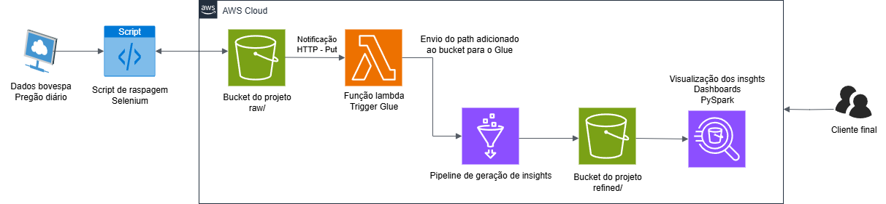

# 📘 FIAP Tech Challenge Big Data Architecture in AWS - Fase 2

ETL dos dados do pregão diário do site da [B3](https://sistemaswebb3-listados.b3.com.br/indexPage/theorical/IBOV?language=pt-br), contendo um script de raspagem e pré-tratamento dos dados com pandas que deve ser acionado diáriamente para uma base sólida de dados. Seguindo para uma arquitetura em nuvem formada por terraform sendo infraestrutura como código.

---

## 📌 Sobre o Projeto

Este repositório corresponde à entrega final da segunda fase do curso de pós-graduação em Engenharia de Machine Learning. Ele tem como objetivo apresentar uma arquitetura em nuvem para um ETL, geração de insights com Glue, automação de tarefas com lambda e armazenagem de dados brutos com S3.

## ⚙️ Tecnologias Utilizadas

| Tecnologia     | Função                                        |
| -------------- | --------------------------------------------- |
| Boto3          | SDK da própria amazon para administrar os serviços               |
| Selenium       | Web scraping do site da B3                    |
| Pandas         | Manipulação de dados tabulares e tranformação para .parquet                |
| Poetry         | Gerenciamento de dependências e ambiente      |

---

## 📐 Arquitetura



---

## 🚀 Como Executar Localmente

### 📦 Requisitos

* [Python 3.11+](https://www.python.org/downloads/)
* [Terraform](https://developer.hashicorp.com/terraform/install) - Deve ter o executavel instalado na máquina.
* [Poetry](https://python-poetry.org/docs/)
* Criação de um job [Glue](https://aws.amazon.com/pt/glue/) via console AWS.
* Visualize o arquivo [env_example](env_example.txt) e crie um **.env** e edite conforme as suas necessidades.
* Crie um arquivo chamado **terraform.tfvars** e replique as linhas do **.env** mas adicione mais uma var chamada **glue_name** onde contera o nome do job glue que você criou no console AWS.

### 📂 Instalação via Poetry

```bash
git clone https://github.com/camilapiva/embrapa-api.git
poetry install
cd ./terraform_arq/
terraform init
terraform plan
terraform apply #Irá pedir confirmação, digite: yes

# Após testar a aplicação:
terraform destroy # Irá derrubar a aplicação toda
```
---
## 📌 Boas Práticas Aplicadas

* Infraestrutura como código 
* Pré-tratamento dos dados antes do upload
* Uso de `.env` para segredos e configurações
---

## 👥 Contribuição

Pull requests são bem-vindos! Abra uma issue ou contribua diretamente via fork + PR.

---

## 📃 Licença

Este projeto está licenciado sob os termos da licença [MIT](LICENSE).
